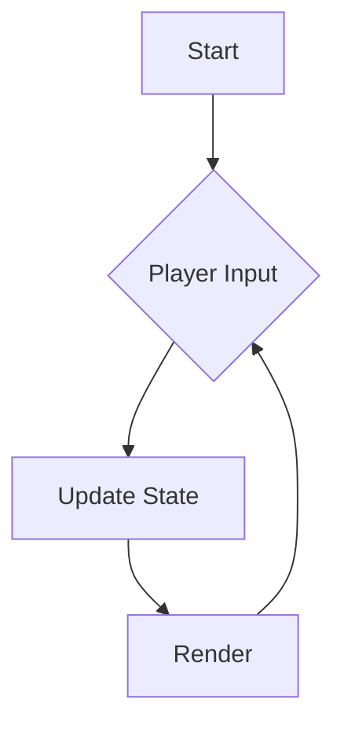

# Cataract — Development Guidelines

## Safe Coding Practices

- Never trust external input. Validate and sanitize all user input, file contents, and network data at system boundaries.
- Avoid command injection, XSS, SQL injection, and other OWASP Top 10 vulnerabilities. When in doubt, use parameterized queries and escape output.
- Never commit secrets, credentials, API keys, or tokens. Use environment variables and `.env` files (which are gitignored).
- Prefer well-maintained libraries over hand-rolled cryptography, authentication, or serialization.
- Handle errors explicitly. Do not silently swallow exceptions or fail open on security checks.
- Use least-privilege principles — request only the permissions and access your code actually needs.

## Documentation Requirements

### Code Documentation

- All public functions, classes, and modules must have clear docstrings or comments explaining their purpose, parameters, and return values.
- Document *why*, not just *what*. If a design decision is non-obvious, explain the reasoning inline.
- When you change code, update the corresponding documentation in the same commit. Code and docs must never drift apart.

### Project Documentation

- Keep a living `ARCHITECTURE.md` at the repo root describing the high-level structure, major components, and how they interact.
- Each major subsystem or module directory should contain a `README.md` explaining its purpose, public API, and usage examples.
- Document all configuration options, environment variables, and build steps.

## Diagrams and Graphs

- Use [Mermaid](https://mermaid.js.org/) for all diagrams. Mermaid renders natively in GitHub markdown and requires no external tooling.
- Maintain the following diagrams in `docs/diagrams/` and keep them current as the codebase evolves:

| Diagram | File | Purpose |
|---------|------|---------|
| System architecture | `docs/diagrams/architecture.md` | High-level component overview and data flow |
| Game loop | `docs/diagrams/game-loop.md` | Main loop phases and state transitions |
| Module dependency | `docs/diagrams/module-deps.md` | How modules depend on each other |

- When adding a new subsystem or significantly changing control flow, add or update the relevant diagram.
- Diagrams should be referenced (linked) from the documentation they support, not left orphaned.

### Mermaid Example

````markdown

````

## AI Agent Continuity

This repository is designed to be picked up by future AI agents who may have no prior context. To support this:

### Repository Resources

- **`ARCHITECTURE.md`** — The first file any new agent should read. Describes the overall system, key abstractions, and where to find things.
- **`docs/`** — All project documentation, diagrams, and design decisions.
- **`docs/diagrams/`** — Mermaid diagrams documenting structure and flow.
- **`docs/decisions/`** — Architecture Decision Records (ADRs) for non-obvious choices. Use the format: `NNNN-short-title.md` (e.g., `0001-choose-rendering-engine.md`).
- **`CHANGELOG.md`** — Human-readable log of notable changes, organized by date or version.

### Conventions for Agent Readability

- Prefer explicit over implicit. Name things clearly. Avoid magic numbers and unexplained constants.
- Keep files focused and small. A file with one clear responsibility is easier to understand than a monolith.
- Use consistent naming conventions throughout the codebase. Document the chosen conventions in `ARCHITECTURE.md`.
- When a piece of code exists to work around a bug or limitation, mark it with a `# WORKAROUND:` comment explaining the issue and linking to any relevant tracking.
- When deprecating functionality, mark it with a `# DEPRECATED:` comment explaining what replaces it and when it can be removed.

### Decision Records

When making a non-obvious architectural or design choice, create an ADR in `docs/decisions/`:

```markdown
# NNNN — Title

## Status
Accepted | Superseded by NNNN | Deprecated

## Context
What problem are we solving? What constraints exist?

## Decision
What did we choose and why?

## Consequences
What trade-offs does this introduce?
```
