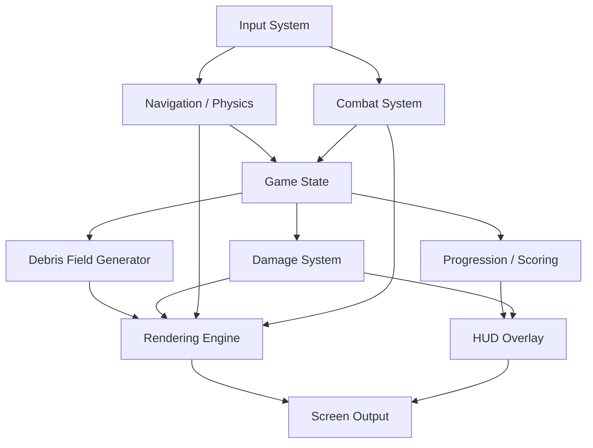

# System Architecture

High-level overview of Cataract's core systems and how they communicate.

## Component Descriptions

| Component | Role |
|-----------|------|
| **Input System** | Captures keyboard/mouse events, maps to game actions |
| **Navigation / Physics** | Applies thrust, gravity, collision detection with debris |
| **Combat System** | Weapon firing, projectile tracking, hit resolution |
| **Game State** | Central state: player position, velocity, shields, score, depth |
| **Debris Field Generator** | Procedurally spawns and despawns debris based on depth |
| **Damage System** | Processes collisions, applies shield/hull damage |
| **Progression / Scoring** | Tracks depth, calculates score, adjusts difficulty |
| **Rendering Engine** | Draws 3D scene, particles, lighting |
| **HUD Overlay** | Shields, hull, depth, score, boost fuel |
