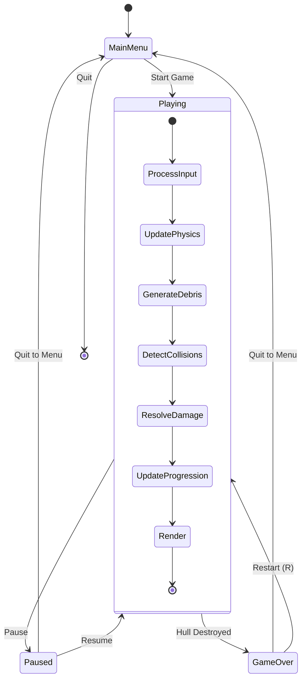

# Game Loop

Main loop phases and state transitions.

## Loop Phases

| Phase | Description |
|-------|-------------|
| **ProcessInput** | Read keyboard/mouse, map to movement and fire commands |
| **UpdatePhysics** | Apply thrust, gravity, update positions and velocities |
| **GenerateDebris** | Spawn/despawn debris based on current depth and density curve |
| **DetectCollisions** | Check player-debris and projectile-debris intersections |
| **ResolveDamage** | Apply shield/hull damage from collisions, fragment destroyed rocks |
| **UpdateProgression** | Update depth, score, difficulty parameters |
| **Render** | Draw scene, particles, HUD |
