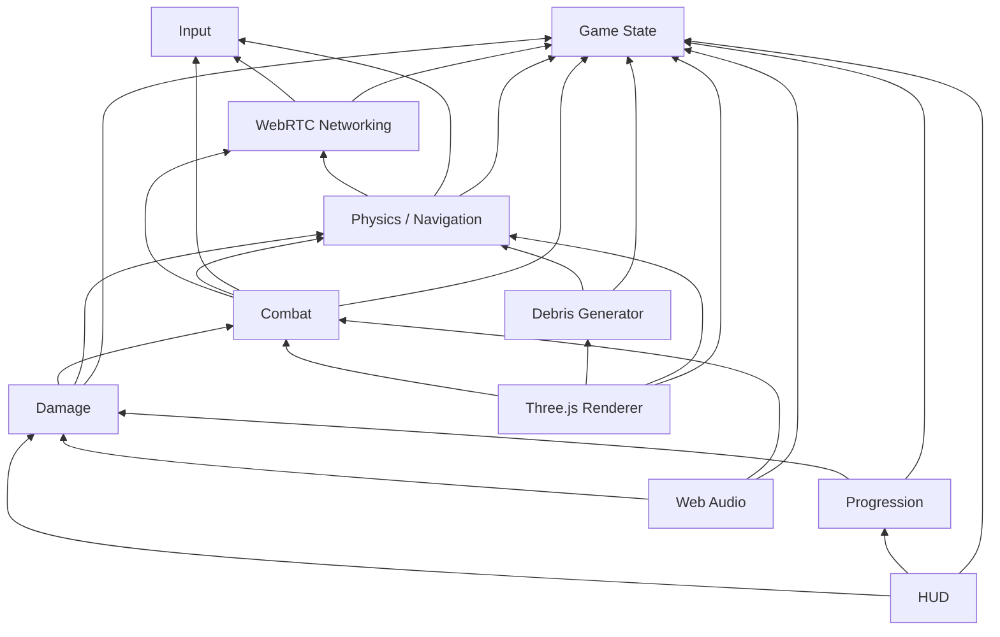

# Module Dependencies

How the major modules depend on each other. Arrows point from dependent to dependency.

## Dependency Notes

- **Game State** is the root dependency — nearly everything reads from it.
- **Input** has no dependencies; it only produces events.
- **WebRTC Networking** reads from State (to broadcast snapshots) and writes to Input (remote player inputs).
- **Physics** and **Combat** consume remote input via the Networking module.
- **Three.js Renderer**, **HUD**, and **Web Audio** are leaf consumers — nothing depends on them.
