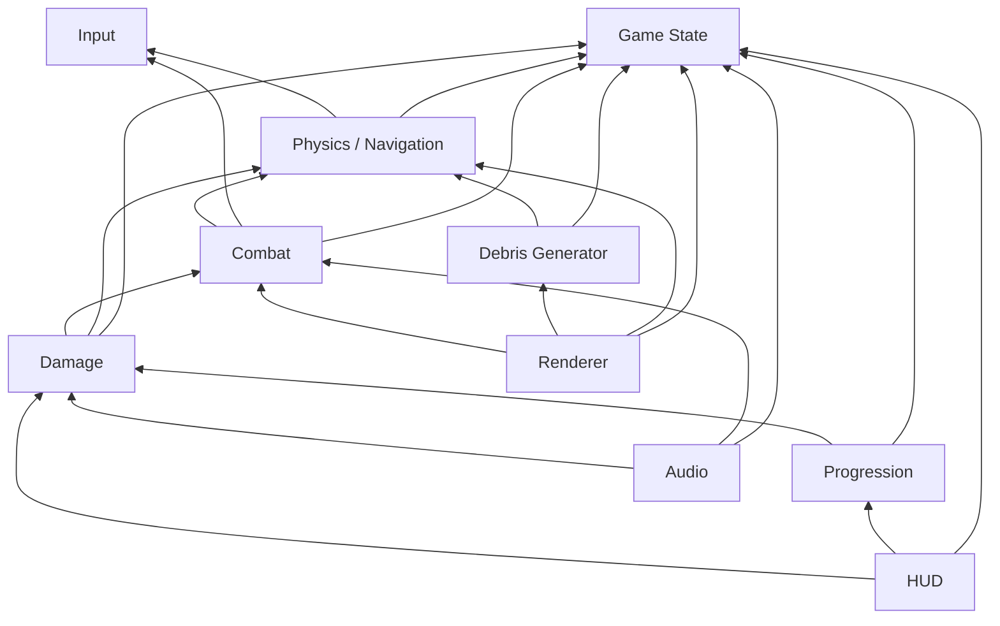

# Module Dependencies

How the major modules depend on each other. Arrows point from dependent to dependency.

## Dependency Notes

- **Game State** is the root dependency — nearly everything reads from it.
- **Input** has no dependencies; it only produces events.
- **Renderer** and **HUD** are leaf consumers — nothing depends on them.
- **Audio** is a leaf consumer driven by combat and damage events.
