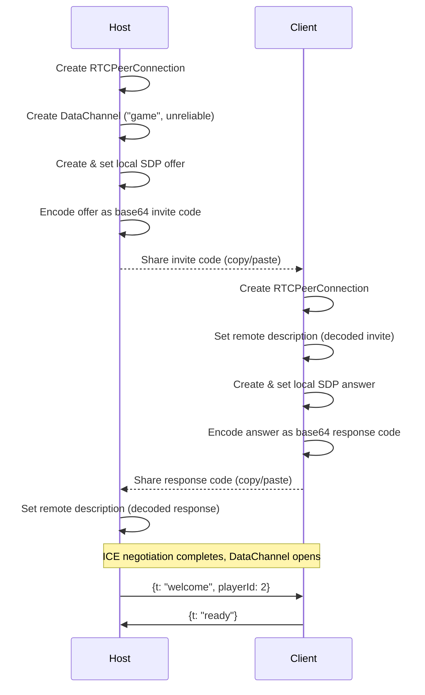
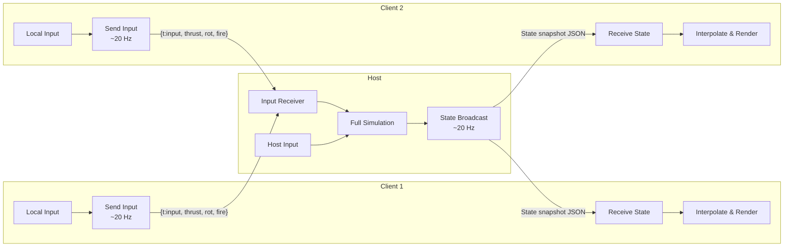

# Networking — WebRTC P2P Multiplayer

## Connection Flow



## Gameplay Data Flow



## Network Protocol

### Client → Host Messages

| Type | Fields | Rate |
|------|--------|------|
| `input` | `thrust` (vec3), `rotation` (vec2), `fire` (bool), `boost` (bool) | ~20 Hz |
| `ready` | — | Once |
| `quit` | — | Once |

### Host → Client Messages

| Type | Fields | Rate |
|------|--------|------|
| `welcome` | `playerId`, `playerCount` | Once |
| `state` | `players[]`, `debris[]`, `projectiles[]`, `explosions[]`, `depth`, `score` | ~20 Hz |
| `playerJoined` | `playerId`, `name` | On event |
| `playerLeft` | `playerId` | On event |
| `gameOver` | `finalScore`, `depth`, `stats` | Once |

## DataChannel Configuration

```javascript
const dc = pc.createDataChannel("game", {
    ordered: false,       // No ordering guarantees (latest state wins)
    maxRetransmits: 0     // No retransmission (low latency over reliability)
});
```
